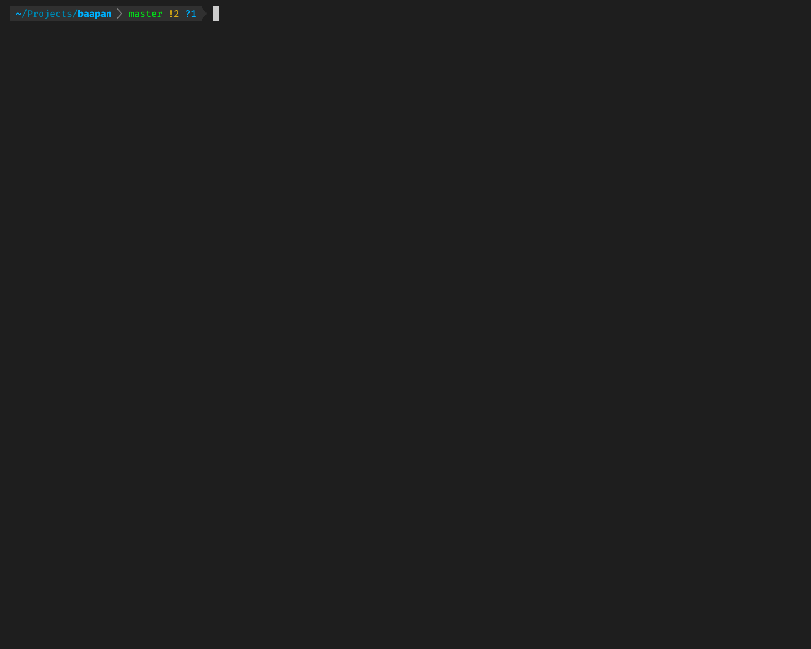

# stdlint
#### A non-opinionated development standard linter that helps you keep your repositories clean and consistent!


### Table of Contents
<!-- toc -->

- [Rationale](#Rationale)
- [What is stdlint](#What-is-stdlint)
- [Installation](#Installation)
  * [Installing per project](#Installing-per-project)
  * [Installing globally](#Installing-globally)
- [Usage](#Usage)
  * [Available options](#Available-options)
  * [Running against a local directory](#Running-against-a-local-directory)
- [Configuring stdlint](#Configuring-stdlint)
- [Using Rule Sets](#Using-Rule-Sets)
- [Writing a rule](#Writing-a-rule)
- [Future work](#Future-work)
- [Contribution](#Contribution)

<!-- tocstop -->
### Rationale

When we work with multiple projects, in a team of developers, we often have to follow some agreed conventions to make sure all our repositories are consistent. Consistency matters a lot especially because if makes it easier to maintain the repositories and enables faster new developer onboarding. However, the conventions we follow as a team of developers can be different depending on the team and developer community. 

A few examples for such conventions are,
- `package.json` should contain the `engines` field with a valid value
- `some_npm_package` package should not be used in the repositories, because we want to use `another_npm_package` package instead.
- Github repository should have branch protection enabled on the default branch. 
- `PULL_REQUEST_TEMPLATE` and `CODEOWNERS` files should exist in all repositories

Conventions like these can be specific and ad-hoc. It is often very difficult to force each project to follow those rules because checking each project for these conventions can be a time-consuming and a manual task.

### What is stdlint

`stdlint` is a CLI tool which can run a set of rules against a repository and report if the repository configuration and the repository content follows the rules. You can think of it as an "A linter for  development conventions".



### Installation

#### Installing per project
To install `stdlint` in one of your projects, go to the project you need to install stdlint and run the following command:

```
npm i stdlint --save-dev
```

After installing stdlint in your project, you can add an npm script to run stdlint in your package.json.

```
"scripts": {
    "stdlint": "stdlint --path ."
}
```

You can then run stdlint using your npm script.

```
npm run stdlint
```

#### Installing globally

Although we don't recommend installing stdlint globally, you can do so as follows:

```
npm i -g stdlint
```

Once you install stdlint globally, you can use `stdlint` CLI command from any directory.

### Usage

`stdlint` needs to access github repositories on behalf of you in order to lint its configurations. Therefore, you need to provide stdlint a [Github personal access token](https://github.com/settings/tokens) which grants `stdlint` API read access to the repositories.

You can pass the personal access token to stdlint by setting it as `GITHUB_AUTH_TOKEN` environment variable in the same shell `stdlint` is run.

#### Available options
```
$ stdlint --help

Usage: stdlint [options]

Options:
  -p, --path <path>      local path of the project git repository
  -u, --url <url>        github repository URL
  -o, --output <output>  output format for the result. one of json, xml, pretty (default: "pretty")
  -l, --level <level>    maximum error tolerance level (default: 1)
  -h, --help             display help for command
```

|  Option   | Description |   
| --- | --- |
| `-p` or `--path`    | Local path of the project git repository. Can be an absolute path or a relative path   |
| `-u` or `--url`    | Github repository URL   |
| `-l` or `--level`   | Maximum tolerance level of errors. Valid values are -1, 0, 1, 2 where the number increases the tolerance level. Set it to `-1` to exit with exitCode 1 on all types of issues. e.g: If set to 0, stdlint will exit with exitCode 1 if at least one issue with `WARN` severity is found.|
| `-h` or `--help`    | Display help and usage of the command   |

#### Running against a local directory

> To run stdlint against a local directory, it is recommended to install stdlint per project and use it with npm scripts. Please refer to the installation instructions.

If you plan to run stdlint with a git CLI hook or a CI stage, you can do so by running stdlint as follows.

```
stdlint --path <absolute_or_relative_path_to_repository>
```

e.g, To run stdlint on the current working directory, run `stdlint --path .`

### Configuring stdlint

You can customise the behaviour of the rules or enable/disable them by using a `.stdlintrc` file at the root of your project.

e.g, You can disable a rule (for example `myAwesomeRule`), but adding it to the `.stdlintrc` file as follows:

```js
{
    "rules": {
        "myAwesomeRule": false
    }
}
```

Some rules can be re-configured too. This is often useful to tweak the rule to fit your needs. If the rule supports customisation, you can pass the rule configuration using `.stdlintrc` as follows:

```js
{
    "rules": {
        "conventionalCommits": {
            "noOfCommitsToCheck": 5
        }
    }
}
```

To see if a particular rule supports any configurations, please refer to the documentation of the rule set.

### Using Rule Sets

`stdlint` does not ship with a built-in rule set. You can instruct `stdlint` to use a rule set by installing it as an npm module and reference the rule set in `.stdlintrc` as the follows. 

Following example shows how to use `stdlint-config-bibliocircle` rule set with `stdlint`. You can find the repository for `stdlint-config-bibliocircle` [here](https://github.com/deepal/stdlint-config-bibliocircle)

e.g,
 - Install `stdlint-config-bibliocircle` module in your project
 - Update the `.stdlintrc` as follows.

 ```
{
  "extends": [
    "stdlint-config-bibliocircle"
  ],
}
 ```

You can extend with more than one rule set by providing them in the `"extends"` array.

### Writing a rule

An example rule is as follows.

```js
module.exports = {
  myAwesomeRule: ({ consts }) => ({
    severity: consts.RULE_SEVERITY.ERROR,
    category: 'Some Rule Category', // stdlint output will be grouped by the 'category' value. This is optional
    checkFunction: async ({ 
        gitClient, // git client
        repoConfig, // github project configuration object
        defaultBranchProtectionConfig, // github branch protection configuration for the default branch
        ruleConfig // custom configuration for the rule passed via `.stdlintrc`
    }) => {
      // Do your checks here, and return an object in the following format:
      return {
        score: 80, // a number between 0-100
        passed: true, // boolean
        message: "Project passed myAwesomeRule with flying colours" // information to show in the stdlint output
      };
    },
  }),
};
```

### Future work

- [ ] `stdlint` only supports Github repositories at the moment. And we'll definitely work towards supporting GitLab and Bitbucket. If you would like `stdlint` to work with any other git service, please let us know by raising an issue.
- [ ] You will need to have `git` command in the shell where `stdlint` is run, because `stdlint` relies on the `git` command. We are working on making `stdlint` free of `git` CLI dependency.

### Contribution

I would love to hear your feedback and suggestions. Please do not hesitate to raise an issue to request a feature or report a bug. And if you are interested in contributing, PRs are always welcome! 🎉. 
